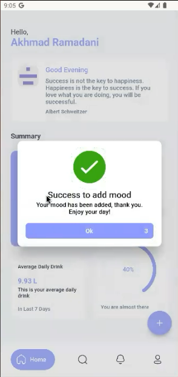

# moodie

Kelompok 1 - Moodie (Mood Journal Application)
 
Anggota:
- Akhmad Ramadani (2041720002)
- Muh. Fauzi Ramadhan Nugraha (2041720022)
- Ahmad Thariq Ramadhan (2041720200)
## Moodie Application

Moodie - Mood Journal Tracker merupakan sebuah aplikasi mood tracker berbasis aplikasi mobile yang bertujuan untuk mencatat dan menyimpan data record mood pengguna aplikasi secara berkala setiap harinya.
  
Aplikasi ini dibuat dengan tujuan untuk menyimpan data data mood harian dari pengguna agar pengguna mampu mengecek data mood mereka dan meninjau apa apa saja yang terjadi dalam keseharian mereka sesuai dengan mood yang didaftarkan.
  
Selan dari itu, kami juga memiliki tujuan agar dapat membuat sebuah aplikasi yang mampu membantu para psikiater diluar sana untuk melakukan tracking perasaan pasien selama menjalani terapi.

## Preview Moodie Application

| Splash Screen | Dashboard Page | Home Page |
| ------------------ | --------------------------- | ------------------ |
|   |  |  |

| Record Mood Page | Notification Page | Profile Page |
| ------------------ | --------------------------- | ------------------ |
|   |  |  |

### Login Section

| Dashboard Page | Pop Up Select Account | Home Page |
| ------------------ | --------------------------- | ------------------ |
|   |  |  |

### Profile Section

| Show User Page | Help Page | Privacy & Police Page | Term of Service Page |
| ------------------ | --------------------------- |--------------------------- | --------------------------- |
|   |  |  |  |

### Add Mood Section

| Add Mood and Emotion | Add Title and Desc | Modal Success | Delete Mood |
| ------------------ | --------------------------- |--------------------------- | --------------------------- |
|   |  |  |   |

### Drink Section

| Drink Page | Add Goals |
| ------------------ | --------------------------- |
|   |  |